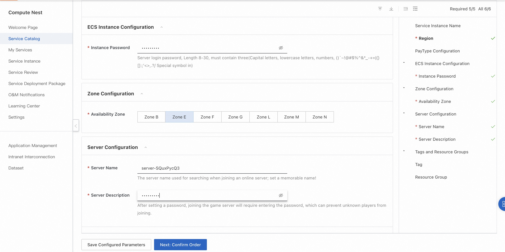
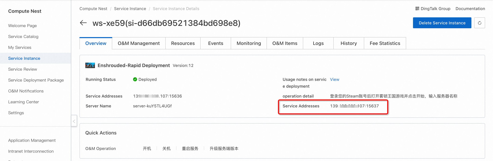

<h1> Deploy Fog Lock Kingdom online service in 3 minutes </h1>

<h2> Overview </h2>

 "Fog Lock Kingdom (Enshrouded)" combines survival, production and action RPG combat. The background of the game is set in a vast continent based on voxel construction. Whether climbing mountains or crossing deserts, players will be able to freely choose the direction of progress and shape their own destiny in this open world. 

<h2> Billing instructions </h2>

 the cost of the online service of fog lock kingdom on the computing nest mainly involves: the selected vCPU and memory specifications, disk capacity, and public network bandwidth
Billing methods include: annual package, monthly package, pay-as-you-go (hours)
The estimated cost can be seen in real time when the instance is created. 

<h2> Create an ECS </h2>

<h3> Step 1: Select Configuration </h3>

<ol>
<li> Service instance name (if there is no special requirement, keep the default);</li>
<li> Select the deployment region (you can select the city closest to you. If there are no special requirements, keep the default value);</li>
<li>
 Select configuration:

<table>
<thead>
<tr>
<th> Package name </th>
<th> Description </th>
</tr>
</thead>
<tbody>
<tr>
<td> Hot sale: Up to 4 players can play </td>
<td>e series 8-core 32G,10M bandwidth unlimited traffic </td>
</tr>
<tr>
<td> Custom Package </td>
<td> ECS configuration can be freely selected, suitable for advanced DIY players </td>
</tr>
</tbody>
</table>
</li>
<li>
 Configure the server password and Availability Zone (if there are no special requirements, keep the default). 
</li>
<li> configure the game parameters. after the configuration is completed, click next to confirm the submission of the order.
</li>
</ol>

<h3> Step 2: Create a service </h3>

<ol>
<li> on the service confirmation page, check agree to the terms of service, click "create now", followed by the payment process. </li>
<li> when the prompt of successful submission appears, the service has been created. click "go to the list to view" to see that the service is being deployed.
</ol>

<h3> Step 3: Enter the instance details </h3>

<ol>
<li> the service can be created in less than 1 minute. when the service status changes to "deployed", click the service instance ID to enter the service details.
<li> by the time of this step, the server-side installation program of fog lock kingdom has been preset in the image of the service, which is very convenient without manual copying. </li>
<li> see "fog lock kingdom server address port", this is the IP address where you built the server, copy this address for the next operation.
</li>
</ol>

<h2> Login to the game </h2>

 Pre-condition: You first need to purchase Fog Lock Kingdom (Enshrouded) on Steam. 

<ol>
<li>
 Log in to your Steam account. 

<li>
 Find the fog lock kingdom in the "library" and start the game. 
</li>
</ol>
