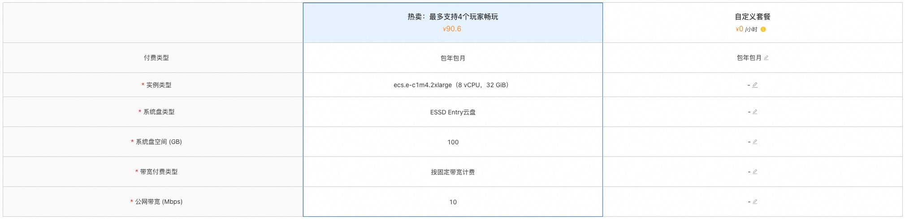
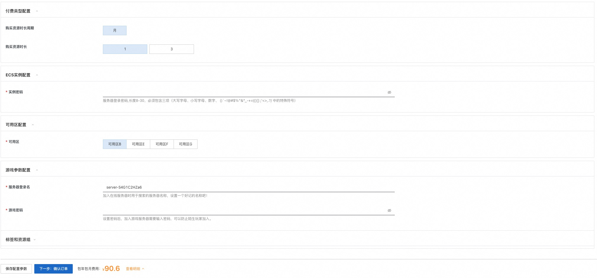

# 3分钟部署雾锁王国联机服务

## 概述

《雾锁王国（Enshrouded）》融合了生存、制作以及动作 RPG 战斗，游戏背景设定在了一个基于体素构筑的辽阔大陆。无论是攀登山脉还是跨越沙漠，玩家将可以在这个开放世界中自由选择前进的方向并塑造自己的命运。

## 计费说明

雾锁王国联机服务在计算巢上的费用主要涉及：所选vCPU与内存规格、磁盘容量、公网带宽
计费方式包括：包年包月、按量付费（小时）
预估费用在创建实例时可实时看到。

## 创建云服务器

### 第一步：选择配置

1. 服务实例名称（如无特殊要求，保持默认即可）；
2. 选择部署地域（可以选择离自己最近的城市，如无特殊要求，保持默认即可）；
3. 选择配置:

   | 套餐名          | 说明                   |
   |--------------|----------------------|
   | 热卖：最多支持4个玩家畅玩   | e系列 8核32G，10M带宽不限流量  |
   | 自定义套餐        | 可自由选择ECS配置，适合高阶DIY玩家 |
   

4. 配置服务器密码和 可用区（如无特殊要求，保持默认即可）。
5. 配置游戏参数，配置完成之后，点击下一步，确认提交订单。
   

### 第二步：创建服务

1. 在服务确认页面，勾选同意服务条款，点击“立即创建”，后面就是付款流程。
2. 当出现提交成功提示，说明服务已经开始创建，点击“去列表查看”，可以看到服务正在部署中。
   

### 第三步：进入实例详情

1. 服务不到1分钟即可完成创建，当服务的状态变成“已部署”，点击服务实例ID进入服务详情。
   
2. 到这一步的时候，雾锁王国的服务端安装程序已经预置在服务的镜像里了，无需手动复制，非常方便。
3. 看到“雾锁王国服务器地址端口”，这就是你搭建服务器的IP地址了，复制这个地址用于下一步操作。
   

## 登录游戏

前置条件：您首先需要在Steam购买雾锁王国（Enshrouded）。

1. 登录您的Steam账号。

   

2. 在“库”中找到雾锁王国，并开始游戏。

